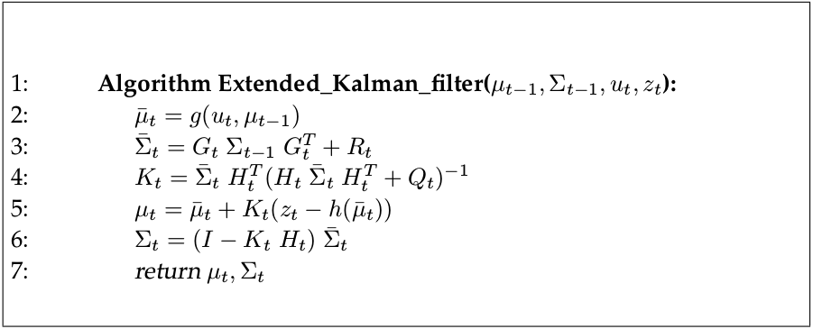

# Sensor Fusion with KF, EKF, and UKF for CV & CTRV Process Models and Lidar & Radar Measurements Models

This repository contains implementations of Kalman filter, extended Kalman filter, and unscented Kalman filter for the selected process and measurement models. 

Process Models:  
- [CV (constant velocity)](#cv-constant-velocity)
- [CTRV (constant turn rate and velocity magnitude)](#ctrv-constant-turn-rate-and-velocity-magnitude)

Measurement Models:  
- [Radar](#radar) 
- [Lidar](#lidar)

The project relies on the 
[Eigen library](http://eigen.tuxfamily.org/index.php?title=Main_Page) for vector and matrix operations.

A great effort has been put in designing abstractions of filter, process model, and measurement model. The code heavily relies on C++ templates and avoids dynamic memory allocations, which is crucial for embedded systems, such as, self-driving car's onboard computer.

## Filters
While implementing different variations of Kalman filters, the notation from the book "Thrun, S., Burgard, W. and Fox, D., 2005. Probabilistic robotics. MIT press." was followed.

### Kalman Filter
The equations below describe the Kalman filter and are implemented in the [KalmanFilter](src/filters/KalmanFilter.hpp) class. 
  
For explanations of what each variable means, please, refer to comments in the code in corresponding files or the book "Thrun, S., Burgard, W. and Fox, D., 2005. Probabilistic robotics. MIT press."

### Extended Kalman Filter
The equations below describe the extended Kalman filter and are implemented in the [ExtendedKalmanFilter](src/filters/ExtendedKalmanFilter.hpp) class. 

For explanations of what each variable means, please, refer to comments in the code in corresponding files or the book "Thrun, S., Burgard, W. and Fox, D., 2005. Probabilistic robotics. MIT press."

### Unscented Kalman Filter
The equations below describe the unscented Kalman filter and are implemented in the [UnscentedKalmanFilter](src/filters/UnscentedKalmanFilter.hpp) class. 

For explanations of what each variable means, please, refer to comments in the code in corresponding files or the book "Thrun, S., Burgard, W. and Fox, D., 2005. Probabilistic robotics. MIT press."

## Process Models

The following illustration helps to understand what the state vector dimensions mean.  

### CV (Constant Velocity)
The CV process model is a process model where the object moves linearly with constant velocity. In this project, CV process model dials with a 2D world. The state vector consists of 4 components---px, py, vx, vy---where p\* represents the position and v\* represents the velocity. The leftmost column in the following equation represents the additive process noise; a\* represents acceleration.

The CV process model is implemented as a [CVProcessModel](src/process_models/CVProcessModel.hpp) class.

### CTRV (Constant Turn Rate and Velocity Magnitude)
The CTRV process model is a process model where the object moves with a constant turn rate and velocity, that is, with zero longitudinal and yaw accelerations. CTRV process model dials with a 2D world. The state vector consists of 5 components---px, py, v, yaw, yaw_rate---where p\* represents the position, v represents the velocity module, yaw represents the [yaw angle](https://en.wikipedia.org/wiki/Aircraft_principal_axes), and yaw_rate represents the yaw velocity. The leftmost column in the following equation represents the non-linear process noise; a_a represents longitudinal acceleration, and a_psi is yaw acceleration.
  
where 

and

The results of solving these integrals depends on the yaw_rate, see [CTRVProcessModel](src/process_models/CTRVProcessModel.hpp).

## Measurement Models

### Lidar
The Lidar measurement model is a linear measurement model. This project does not deal with the lidar point cloud. It assumes that the lidar point cloud has already been processed and a single measurement vector has been identified for the object under consideration. The measurement vector consists of 2 components---px, py---where p\* represents the position. The transformation from the state space to the Lidar measurement space is as follows  

where

The Lidar measurement model is implemented as a [LidarMeasurementModel](src/measurement_models/LidarMeasurementModel.hpp) class.

### Radar
The Radar measurement model is a non-linear measurement model. The measurement vector consists of 3 components---range, bearing, range_rate---where the range is a radial distance from the origin, the bearing is an angle between range and X-axis which points into the direction of the heading of the vehicle, where sensors are installed, and range_rate is a radial velocity. The transformation from the state space to the Radar measurement space is as follows  

where

The Radar measurement model is implemented as a [RadarMeasurementModel](src/measurement_models/RadarMeasurementModel.hpp) class.
